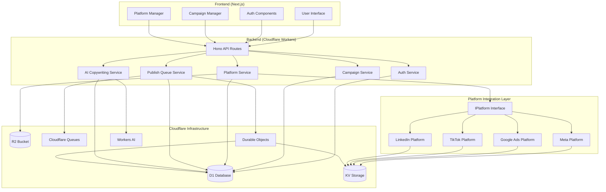

# Unified Social Media Ads SaaS Platform

A full-stack SaaS platform to create once and publish campaigns across multiple ad platforms from one dashboard.

## What This Project Does

This project provides:

- User authentication and session handling
- Campaign creation, editing, duplication, and deletion
- Platform connection management
- Media upload and management
- Async campaign publishing through Cloudflare Queues
- Campaign status tracking with per-platform progress
- AI-assisted ad copy generation and analysis (mock service)

Supported platform types in backend:

- meta
- google_ads
- tiktok
- linkedin

Frontend Platforms page currently shows cards for:

- Instagram (mapped to meta)
- Facebook (mapped to meta)
- Google Ads
- LinkedIn

## Tech Stack

### Frontend

- Next.js 14 (App Router)
- React 18
- Tailwind CSS
- SWR
- Axios
- React Hot Toast

### Backend

- Cloudflare Workers
- Hono
-  (SQLite)
- Cloudflare KV
- Cloudflare R2
- Cloudflare Queues
- Durable Objects

## Repository Structure

- frontend: Next.js UI
- backend: Worker API, repositories, services, queue worker
- shared: shared constants and validators
- DEPLOYMENT.md: deployment-focused instructions

## Core Architecture

### Backend Layers

- Adapters: platform-specific behavior (Meta, Google, TikTok, LinkedIn)
- Repositories: D1 data access (users, campaigns, platforms, jobs, media)
- Services: business logic (auth, campaigns, publish, media, platforms)
- Queue worker: async job execution and retries

### Architecture Diagram



### Async Publish Flow

1. User publishes a campaign
2. Backend creates publishing_jobs rows
3. Messages are sent to publish-queue
4. Worker queue handler processes each message
5. Adapter creates ads on target platform
6. publishing_jobs and campaign_platforms statuses are updated
7. Frontend polls status endpoint and renders progress

## Local Development Setup

## 1. Prerequisites

- Node.js 18+
- npm
- Wrangler CLI (via local dependency or npx)
- Cloudflare account with D1/KV/R2/Queues configured

## 2. Install Dependencies

From project root:

```bash
cd backend
npm install

cd ../frontend
npm install
```

## 3. Backend Configuration

Backend config is in backend/wrangler.toml.

Required bindings used by the code:

- DB (D1)
- CACHE (KV)
- MEDIA_BUCKET (R2)
- PUBLISH_QUEUE (Queue producer)
- publish-queue consumer

Queue bindings expected:

```toml
[[queues.consumers]]
queue = "publish-queue"

[[queues.producers]]
binding = "PUBLISH_QUEUE"
queue = "publish-queue"
```

## 4. Apply Database Schema

```bash
cd backend
npm run db:local
```

For remote database migrations:

```bash
npm run db:migrate
```

## 5. Run Backend

```bash
cd backend
npm run dev
```

Default local URL is typically:

- http://localhost:8787

## 6. Run Frontend

Set frontend env variable in frontend/.env.local:

```env
NEXT_PUBLIC_API_URL=http://localhost:8787
```

Start frontend:

```bash
cd frontend
npm run dev
```

Default local URL:

- http://localhost:3000

## Scripts

### Backend scripts

- npm run dev
- npm run deploy
- npm run deploy:staging
- npm run deploy:production
- npm run db:migrate
- npm run db:local
- npm run test

### Frontend scripts

- npm run dev
- npm run build
- npm run start
- npm run lint
- npm run export

## API Reference

All protected endpoints require:

- Authorization: Bearer <token>

Response envelope:

- success: boolean
- data (on success)
- error (on failure)
- timestamp

### Health

- GET /health

### Auth

- POST /api/auth/signup
- POST /api/auth/login

### Campaigns

- GET /api/campaigns
- POST /api/campaigns
- GET /api/campaigns/:id
- PUT /api/campaigns/:id
- DELETE /api/campaigns/:id
- POST /api/campaigns/:id/duplicate

### Media

- POST /api/media/upload
- GET /api/media
- DELETE /api/media/:id

### Platforms

- POST /api/platforms/connect
- GET /api/platforms
- DELETE /api/platforms/:platformType

### Publish and Status

- POST /api/publish
- GET /api/status/:campaignId

### AI

- POST /api/ai/generate-copy
- POST /api/ai/analyze-copy

## Platform Connection Behavior

- Campaign creation validates selected platforms are connected and active.
- Platform disconnect is implemented as soft disconnect:
  - isActive false
  - tokens cleared
  - metadata updated with disconnectedAt
- Soft disconnect avoids foreign key breakage for historical campaign_platforms rows.

## Queue Processing Notes

- Messages are produced through env.PUBLISH_QUEUE.
- Worker entry exports queue(batch, env, ctx) for consumer handling.
- If queue send fails, campaign_platform status is marked failed (no silent pending).
- Job retries use exponential backoff fields on publishing_jobs.

## Database Overview

Primary tables:

- users
- platforms
- media
- campaigns
- campaign_platforms
- publishing_jobs
- campaign_templates
- analytics

Important relationships:

- campaigns.user_id -> users.id
- campaign_platforms.campaign_id -> campaigns.id
- campaign_platforms.platform_id -> platforms.id
- publishing_jobs.campaign_platform_id -> campaign_platforms.id

## Frontend Pages

- /auth/login
- /auth/signup
- /dashboard
- /dashboard/campaign/create
- /dashboard/campaign/[id]
- /dashboard/platforms

## Known Mocked Components

The current implementation contains mocked adapter/auth behavior for platform integrations and AI behavior. Replace adapter authenticate/create/status logic with real provider OAuth and API calls for production use.

## Common Issues and Fixes

### Platform status stuck at PENDING

Check:

- Queue producer binding exists in wrangler.toml
- Queue consumer exists in wrangler.toml
- Worker export includes queue handler
- Wrangler dev server restarted after config changes

### D1 Type object not supported

Cause:

- Passing Date objects directly to D1 bind

Fix:

- Normalize Date values to ISO strings before repository execute/update

### Foreign key constraint on platform disconnect

Cause:

- Hard deleting a platform referenced by campaign_platforms

Fix:

- Use soft disconnect (isActive false, clear tokens) instead of delete

### Frontend changes not visible

- Restart frontend dev server
- Hard refresh browser (Ctrl+F5)
- Confirm route path (for platform cards use /dashboard/platforms)

## Security Notes

For real deployment:

- Never commit real secrets to repository
- Store JWT_SECRET and OPENAI_API_KEY via Wrangler secrets
- Add proper password hashing (bcrypt/argon2) for production-grade auth
- Implement OAuth PKCE flows for each ad platform
- Add request validation and rate limits for public endpoints

## Deployment

Use DEPLOYMENT.md for full environment and rollout instructions.

## How to Add a New Platform

This section explains how to extend the platform integration layer to support a new ad platform (e.g., TikTok, Twitter Ads, Pinterest Ads).

### Step 1: Create Platform Class

Create a new file in `backend/src/platforms/` following the naming convention `[PlatformName]Platform.ts`:

```typescript
// backend/src/platforms/TikTokPlatform.ts
import { 
  IPlatform, 
  BasePlatform, 
  PlatformCredentials, 
  AdPayload, 
  AdResponse, 
  StatusCheckResponse, 
  ValidationResult 
} from './IPlatform';

export class TikTokPlatform extends BasePlatform {
  constructor(credentials: PlatformCredentials) {
    super('tiktok', 'v1.0', 'https://business-api.tiktok.com', credentials);
  }

  async authenticate(authCode: string, redirectUri: string): Promise<PlatformCredentials> {
    // Implement TikTok OAuth 2.0 flow
    // Exchange auth code for access token
    // Return credentials with expiry
  }

  async publish(payload: AdPayload): Promise<AdResponse> {
    // Validate payload first
    const validation = await this.validatePayload(payload);
    if (!validation.isValid) {
      return {
        adId: '',
        status: 'rejected',
        message: `Validation failed: ${validation.errors.join(', ')}`,
      };
    }

    // Create campaign, ad group, and ad using TikTok API
    // Return proper AdResponse with real ad ID
  }

  async getStatus(adId: string): Promise<StatusCheckResponse> {
    // Check ad status via TikTok API
    // Return real metrics (impressions, clicks, spend)
  }

  async deleteAd(adId: string): Promise<{ success: boolean; message?: string }> {
    // Delete ad via TikTok API
  }

  async validateConnection(): Promise<boolean> {
    // Test API connection with stored credentials
  }

  protected async performPlatformValidation(payload: AdPayload): Promise<ValidationResult> {
    // Platform-specific validation rules
    const errors: string[] = [];
    const warnings: string[] = [];

    // TikTok-specific requirements
    if (payload.adCopy && payload.adCopy.length > 255) {
      errors.push('TikTok ad copy must be 255 characters or less');
    }

    if (payload.budget && payload.budget < 10) {
      errors.push('TikTok minimum budget is $10');
    }

    return { isValid: errors.length === 0, errors, warnings };
  }

  protected async performTokenRefresh(): Promise<PlatformCredentials> {
    // Refresh TikTok access token if expired
  }

  // Platform-specific helper methods
  private async createCampaign(accountId: string, name: string) {
    // TikTok campaign creation logic
  }

  private async createAdGroup(campaignId: string, budget: number) {
    // TikTok ad group creation logic
  }

  private async createAd(adGroupId: string, payload: AdPayload) {
    // TikTok ad creation logic
  }
}
```

### Step 2: Update Platform Type

Add the new platform type to shared types:

```typescript
// shared/types/platform.ts
export type PlatformType = 'meta' | 'google_ads' | 'tiktok' | 'linkedin' | 'twitter_ads';
```

### Step 3: Update Platform Factory

Register the new platform in the factory:

```typescript
// backend/src/adapters/PlatformFactory.ts
import { TikTokPlatform } from '../platforms/TikTokPlatform.js';

export class PlatformFactory {
  static createAdapter(platformType: PlatformType, accessToken: string, refreshToken?: string, env?: any): BasePlatformAdapter {
    switch (platformType) {
      case 'meta':
        return new MetaPlatform({ accessToken, refreshToken, appId: env?.META_APP_ID, appSecret: env?.META_APP_SECRET });
      case 'tiktok':
        return new TikTokPlatform({ accessToken, refreshToken, appId: env?.TIKTOK_APP_ID, appSecret: env?.TIKTOK_APP_SECRET });
      // ... other platforms
    }
  }
}
```

### Step 4: Add Environment Variables

Update `wrangler.toml` with new platform credentials:

```toml
[env.production.vars]
TIKTOK_APP_ID = "your_tiktok_app_id"
TIKTOK_APP_SECRET = "your_tiktok_app_secret"
```

### Step 5: Update Frontend

Add the new platform to the frontend platform cards:

```jsx
// frontend/app/dashboard/platforms/page.jsx
const platforms = [
  {
    id: 'tiktok',
    name: 'TikTok Ads',
    description: 'Reach TikTok\'s engaged audience',
    icon: '🎵',
    color: 'bg-pink-500',
    connected: false,
  },
  // ... other platforms
];
```

### Step 6: Database Migration

If the new platform requires additional database fields, create a migration:

```sql
-- backend/src/migrations/add_tiktok_fields.sql
ALTER TABLE platforms ADD COLUMN tiktok_account_id TEXT;
ALTER TABLE campaign_platforms ADD COLUMN tiktok_ad_group_id TEXT;
```

### Step 7: Testing

Create tests for the new platform:

```typescript
// backend/src/__tests__/TikTokPlatform.test.ts
import { TikTokPlatform } from '../platforms/TikTokPlatform';

describe('TikTokPlatform', () => {
  it('should validate payload correctly', async () => {
    const platform = new TikTokPlatform(mockCredentials);
    
    const validPayload = {
      adCopy: 'Test ad copy',
      adName: 'Test Ad',
      campaignName: 'Test Campaign',
      budget: 50,
    };

    const result = await platform.validatePayload(validPayload);
    expect(result.isValid).toBe(true);
  });

  it('should reject invalid budget', async () => {
    const platform = new TikTokPlatform(mockCredentials);
    
    const invalidPayload = {
      adCopy: 'Test ad copy',
      adName: 'Test Ad', 
      campaignName: 'Test Campaign',
      budget: 5, // Below minimum
    };

    const result = await platform.validatePayload(invalidPayload);
    expect(result.isValid).toBe(false);
    expect(result.errors).toContain('TikTok minimum budget is $10');
  });
});
```

### Step 8: Documentation

Update API documentation with new platform endpoints:

```markdown
## TikTok Ads Integration

### OAuth Flow
1. Redirect user to TikTok OAuth URL
2. Exchange authorization code for access token
3. Store credentials in platforms table

### API Endpoints
- POST /api/platforms/oauth/tiktok - Get OAuth URL
- POST /api/platforms/connect/tiktok - Handle OAuth callback

### Required Permissions
- tiktok_ads_management
- tiktok_ads_read
```

### Platform-Specific Considerations

**Rate Limiting**: Each platform has different rate limits. Implement proper rate limiting in the platform class.

**Error Handling**: Map platform-specific error codes to standard error responses.

**Webhooks**: If the platform supports webhooks, implement webhook handlers for real-time status updates.

**Media Upload**: Handle platform-specific media requirements (dimensions, formats, file sizes).

**Targeting**: Implement platform-specific targeting options and validation.

### Example: Complete TikTok Integration

For a complete TikTok integration, you would need to:

1. **Register App**: Create TikTok Developer account and register your app
2. **OAuth Setup**: Configure OAuth redirect URI and required scopes
3. **API Integration**: Implement all required API endpoints
4. **Testing**: Test with TikTok's sandbox environment
5. **Documentation**: Document platform-specific requirements and limitations

This modular approach makes it easy to add new platforms while maintaining code consistency and reusability.

## Technical Implementation Details

### Error Handling Strategy

The platform implements a comprehensive error handling strategy:

**Platform-Level Error Handling**
- Exponential backoff retries for transient failures
- Platform-specific error mapping to standard responses
- Graceful degradation when platforms are unavailable
- Detailed error logging for debugging

**API-Level Error Handling**
- Consistent error response format across all endpoints
- HTTP status codes aligned with REST standards
- Input validation with clear error messages
- Rate limiting with proper error responses

**Database Error Handling**
- Transaction rollback on failures
- Connection pooling management
- Query timeout handling
- Data integrity constraints

### Performance Optimization

**Async Processing**
- Queue-based job processing prevents request timeouts
- Batch processing for multiple platform operations
- Parallel execution where possible
- Resource pooling for database connections

**Caching Strategy**
- KV storage for frequently accessed data
- Platform credential caching with TTL
- API response caching for status checks
- Static asset caching via CDN

**Database Optimization**
- Indexed queries for fast lookups
- Connection pooling for high concurrency
- Query result pagination
- Efficient schema design

### Security Implementation

**Authentication & Authorization**
- JWT-based authentication with secure token signing
- Role-based access control (RBAC) framework
- Platform-specific OAuth 2.0 flows
- Session management with secure cookies

**Data Protection**
- Encrypted storage for sensitive credentials
- HTTPS enforcement for all communications
- Input sanitization and validation
- SQL injection prevention via parameterized queries

**API Security**
- Rate limiting per user and platform
- Request size limits
- CORS configuration for frontend access
- API key management for third-party integrations

### Monitoring & Observability

**Logging Strategy**
- Structured logging with JSON format
- Log levels (DEBUG, INFO, WARN, ERROR)
- Correlation IDs for request tracing
- Platform-specific error categorization

**Metrics Collection**
- Request latency and throughput
- Platform API success/failure rates
- Queue processing times
- Database query performance
- User engagement metrics

**Health Checks**
- Database connectivity checks
- Platform API availability monitoring
- Queue system health
- Worker process monitoring

### Scalability Considerations

**Horizontal Scaling**
- Stateless API design for easy scaling
- Queue-based processing for workload distribution
- Durable Objects for state management
- CDN integration for global performance

**Resource Management**
- Memory usage optimization
- CPU utilization monitoring
- Storage capacity planning
- Network bandwidth management

**Load Distribution**
- Geographic distribution via Cloudflare edge
- Database read replicas for query scaling
- Queue partitioning for high throughput
- Cache warming strategies

### Testing Strategy

**Unit Testing**
- Platform adapter testing with mocks
- Service layer business logic testing
- Database repository testing
- Utility function validation

**Integration Testing**
- End-to-end API testing
- Platform integration testing
- Queue processing testing
- Database migration testing

**Load Testing**
- Concurrent user simulation
- Platform API rate limit testing
- Queue throughput testing
- Database performance testing

### Deployment Architecture

**Environment Management**
- Development, staging, production environments
- Environment-specific configuration
- Database migration automation
- Blue-green deployment strategy

**Infrastructure as Code**
- Wrangler configuration management
- Cloudflare resource provisioning
- Automated deployment pipelines
- Rollback procedures

**Monitoring in Production**
- Real-time alerting system
- Performance dashboards
- Error tracking and reporting
- User behavior analytics

## Suggested Next Enhancements

1. Replace mocked platform adapters with real OAuth and API integrations
2. Add webhook-based status updates (reduce polling)
3. Add role-based access control and team workspaces
4. Add automated integration tests for publish pipeline
5. Add observability dashboards for queue lag and failure rates
# cloudflare-internship-ads-platform

